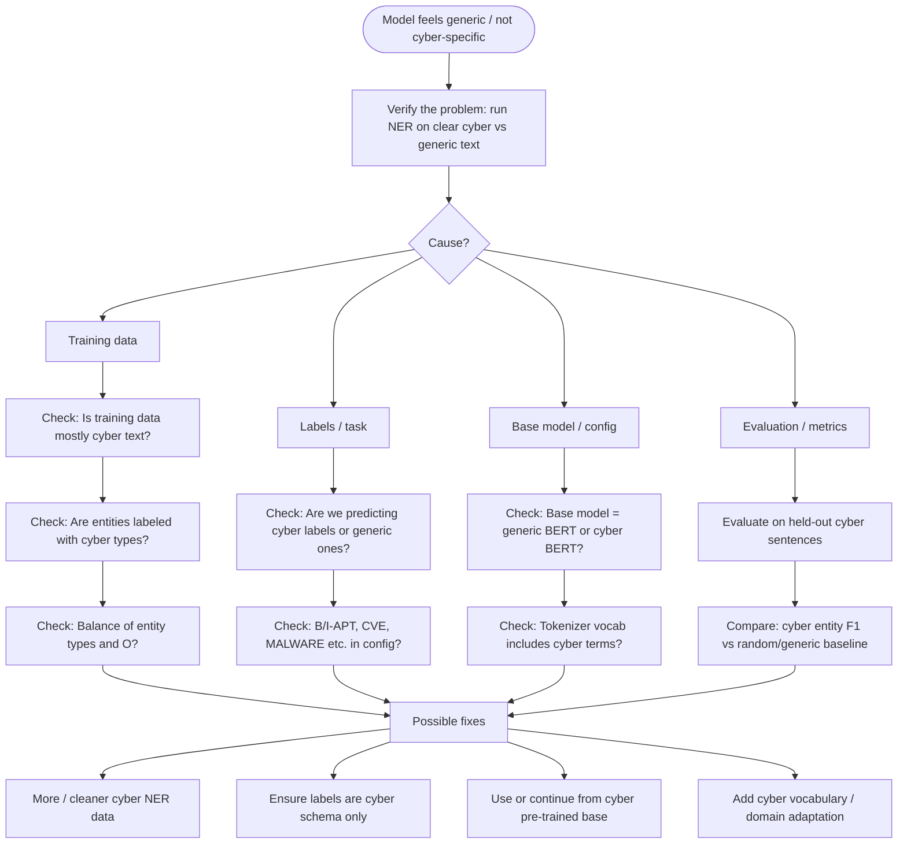

# Why is the model doing generic (non–cybersecurity) predictions?

This doc is a **basic flowchart** of how to find out what’s wrong when the NER model behaves like a normal/generic model instead of being cybersecurity-specific.

---

## Flowchart (high level)



---

## Step-by-step: what to do

### 1. **Verify the problem**

- Run the current NER on:
  - **Cyber text**: e.g. “APT28 exploited CVE-2023-12345 using Mimikatz.”
  - **Generic text**: e.g. “John went to Paris on Monday.”
- **Check**: Does it tag cyber terms (APT, CVE, MALWARE, etc.) on the first and mostly O or wrong types on the second?  
  If it tags “John”, “Paris”, “Monday” as entities and treats cyber terms as O or wrong types → **model is behaving generically**.

---

### 2. **Possible causes**

| Area | What to check |
|------|----------------|
| **Training data** | Is the dataset mainly **cybersecurity** text? Are entities labeled with **cyber** types (APT, CVE, MALWARE, TOOL, etc.) and not generic (PERSON, LOC, ORG)? |
| **Labels / task** | Does `config.json` (id2label) define **cyber** types only? If the model was trained with a mix of generic + cyber labels, it will predict generic types. |
| **Base model** | Was the NER model built on a **generic** BERT (e.g. bert-base) or a **cyber-domain** model (e.g. CyBERT, security-tuned)? Generic base = more generic predictions. |
| **Evaluation** | Have you measured performance on **cyber-only** sentences and entity types? Low F1 on cyber entities while “overall” looks OK can hide that it’s not cyber-specific. |

---

### 3. **Concrete checks in this repo**

1. **Data**  
   - Open `datasets/cyber/cyberner_clean.csv` (or the one used for training).  
   - Confirm: sentences are cyber content and tags are cyber (e.g. B-APT, I-CVE, B-MALWARE), not PERSON/LOC/ORG.

2. **Model config**  
   - Open `models/mini_cybert_final/config.json`.  
   - Check `id2label`: should be things like APT, CVE, MALWARE, TOOL, VULNERABILITY, etc., not PERSON, LOCATION, ORG.

3. **Training script**  
   - See which dataset and label set `model_training.ipynb` (or your training script) uses.  
   - Confirm: only cyber labels and cyber (or cyber-heavy) text.

4. **Evaluation**  
   - Run `scripts/evaluate_ner.py` on a **cyber** dev set.  
   - Report **per entity type** (APT, CVE, MALWARE, etc.). If F1 is low for cyber types, the model isn’t reliably cyber-specific.

---

### 4. **Possible fixes (after you find the cause)**

- **Data**: Add more cyber NER data; remove or relabel generic labels so the task is clearly “cyber NER only”.
- **Labels**: Train and evaluate only with a **cyber** label set (no PERSON/LOC/ORG in the schema).
- **Base model**: Start from a cyber-oriented LM (e.g. CyBERT) or do a short domain adaptation on cyber text before NER fine-tuning.
- **Evaluation**: Define a small set of **cyber** test sentences and track F1 per cyber type; use that to decide if the model is “cyber-specific enough”.

---

## One-page summary

```
Problem: "Model is just doing normal predictions, not cybersecurity-specific."

1. VERIFY    → Run on cyber vs generic sentences; see if it tags cyber terms with cyber types.
2. DATA      → Training data cyber? Labels cyber (APT, CVE, MALWARE, etc.)?
3. CONFIG    → id2label in model = cyber schema only?
4. BASE      → NER trained from generic BERT or cyber BERT?
5. EVALUATE  → F1 on cyber entities; compare to baseline.

Then fix: data, labels, base model, or evaluation target.
```

You don’t have to finish all of this by Saturday; this flowchart and checklist are enough to **find out what’s wrong** and then plan the fix.
